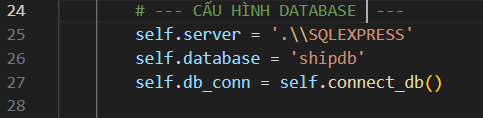
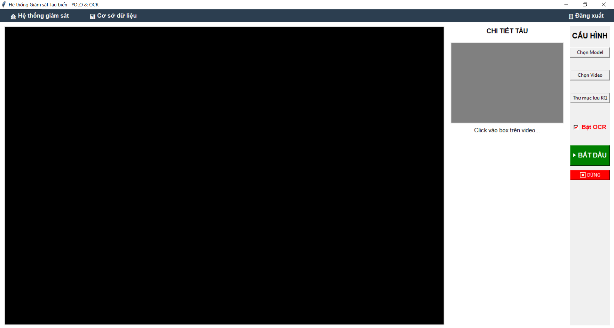
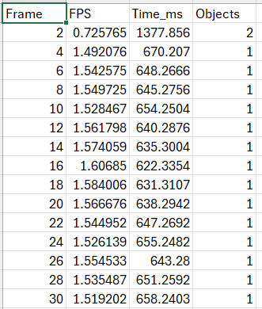
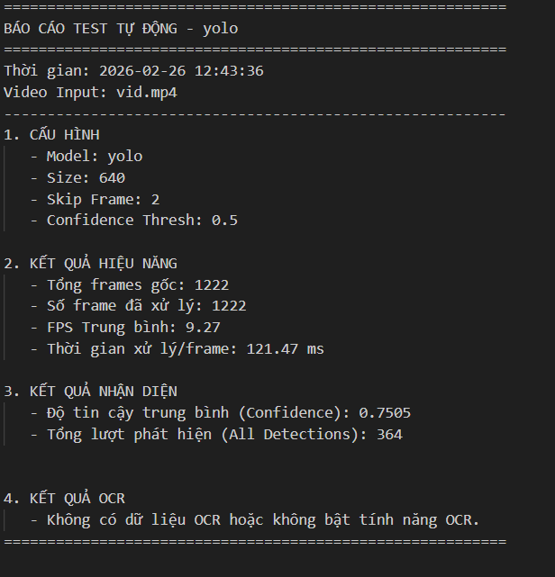
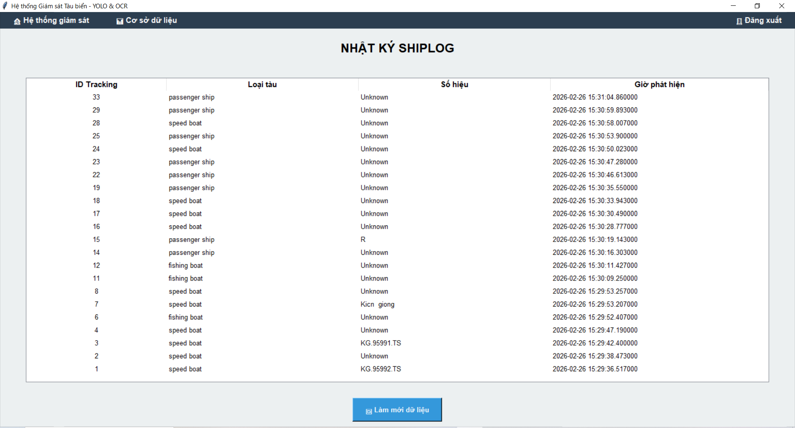

Hệ Thống Giám Sát Tàu Biển (Ship Detection & OCR)
Dự án tích hợp mô hình YOLOv12 để phát hiện, theo dõi (tracking) tàu biển và thư viện PaddleOCR để nhận diện mã số/tên tàu từ video giám sát. Giao diện được xây dựng trên nền tảng Tkinter.
Tính năng chính
Real-time Tracking: Phát hiện và theo dõi tàu biển với độ chính xác cao bằng YOLO.
On-demand OCR: Chỉ thực hiện nhận diện chữ khi người dùng Click chuột vào đối tượng tàu, giúp tối ưu hiệu năng (không gây lag video).
Báo cáo thông minh: Tự động xuất báo cáo kết quả gồm FPS, số lượng đối tượng và nội dung OCR sau khi kết thúc video.
Giao diện trực quan: Xem video trực tiếp, xem ảnh cắt (crop) của tàu và kết quả nhận diện ngay trên màn hình.
Yêu cầu hệ thống
Python: 3.9 - 3.11
Phần cứng: Khuyến nghị có GPU NVIDIA , hoặc CPU Intel.
<Cấu hình máy chạy thử nghiệm - Nminh
Device Name	DESKTOP-5CK9U1Q
Processor	Intel(R) Core(TM) i5-8300H CPU @ 2.30GHz   2.30 GHz
Installed RAM	16.0 GB 
Storage	119 GB SSD SanDisk X600 M.2 2280 SATA 128GB, 932 GB HDD WDC WD10SPZX-21Z10T0
Graphics Card	NVIDIA GeForce GTX 1050 (4 GB), Intel(R) UHD Graphics 630 (128 MB)
Python: 3.11.8
CUDA Vesion: 13.0
Microserver SQL 22
>
Hướng dẫn sử dụng
(Bước 0: Setup
Nều cài môi trường ảo do xung đột các thư viện làm bước 0.1. 0.2
0.1. Cài môi trường ảo
python -m venv venv
0.2. Kích hoạt môi trường ảo mỗi lần khởi động
.\venv\Scripts\activate
0.3. Cài đặt thư viện 
pip install -r requirements.txt
0.4. Setup CSDL
file csdl ở founder sql

)
Bước 1: Khởi chạy ứng dụng 
Chạy file main.py từ terminal hoặc IDE xong đăng nhập

Bước 2: 
Cấu hình trên giao diện

Chọn Model: Tìm đến file weight của YOLO (ví dụ: yolov12x_fish-speed-pass.pt).
Trong founder model
Chọn Video: Chọn video tàu biển cần phân tích.
Trong founder video
Thư mục lưu KQ: Chọn nơi sẽ lưu video kết quả và file báo cáo (Report).
Bật OCR: Tích chọn "Bật OCR" nếu bạn muốn nhận diện tên tàu.
 
Bước 3: Thao tác khi đang chạy
Nhấn BẮT ĐẦU để chạy xử lý.
Click chuột trái trực tiếp vào khung hình (Bounding Box) của một con tàu trên video.
Hệ thống sẽ ngay lập tức cắt ảnh con tàu đó và hiển thị tại cột CHI TIẾT TÀU, sau đó trả kết quả OCR (tên tàu) sau vài giây.
 
Kết quả đầu ra
- Sau khi nhấn DỪNG hoặc video kết thúc:
- Video: Một file .mp4 có vẽ khung hình và tên tàu sẽ được lưu trong thư mục Output.
- Báo cáo: File báo cáo (Excel/CSV/JSON tùy thuộc vào report_utils.py) chứa các thống kê về hiệu năng và danh sách các tàu đã nhận diện được.

- Cơ sở dữ liệu: Thông tin được lưu: 
ID Tracking
Loại tàu
Số hiệu tàu (OCR)
Thời điểm phát hiện

 
 
 

